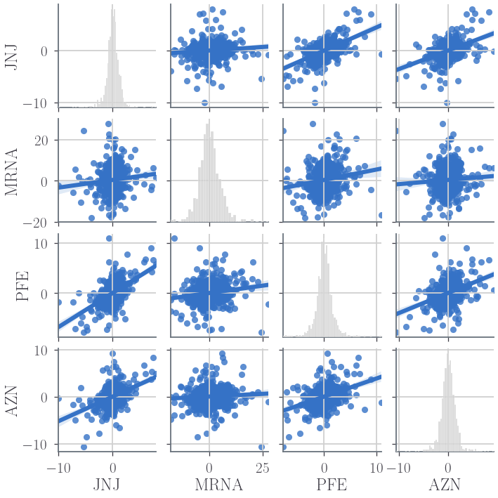

# This notebook is for analysing some pharmaceutical stocks taken from Yahoo finance. We will visualize different aspects of data, analyze the risk of a stock based on its previous performance historym, and also be predicting future stock prices.


# The questions to answer are the following:


# 1.) What was the change in price of the stock over time?

# 2.) What was the daily return of the stock on average?

# 3.) What was the moving average of the various stocks?

# 4.) What was the correlation between different stocks'?

# 5.) How much value do we put at risk by investing in a particular stock?

# 6.) How can we attempt to predict future stock behavior?


```python
#Setting jupyter notebook style. Need to install jtplot
!jt -t grade3 -tfs 16 -fs 16 -cursw 2 -cursc r -cellw 90% -T -mathfs 110 -lineh 150
plot_theme = 'grade3'

# Importación de Librerías
import numpy as np
import pandas as pd
import seaborn as sns
import matplotlib as mpl
import matplotlib.pyplot as plt
from scipy import special as sp
import math as mt
from matplotlib import rc, rcParams
from jupyterthemes import jtplot
from cycler import cycler
dash_espacio = [5,5]

def grafica_params(fscale=2, linea=4, context='talk'):
    jtplot.style(theme=plot_theme, context = context, ticks = True, grid = True, fscale = fscale)
    plt.rcParams['text.usetex'] = True
    plt.rc('text', usetex=True)
    font = {'family': 'serif', 'weight': 'bold'}
    plt.rc('font', **font)
    plt.rc('lines', lw=linea)
grafica_params()
```


# 1. What was the change in price of the stock overtime?


```python
%matplotlib inline
from pandas_datareader.data import DataReader # For reading stock data from yahoo
from datetime import datetime
```


```python
# The pharmaceutical stocks that will be used for this analysis from yahoo finance
pharma_list = ['JNJ', 'MRNA', 'PFE', 'AZN'] #, 'SVA']

# Set up End and Start dates
end = datetime.now()
start = datetime(end.year - 4, end.month, end.day)

for stock in pharma_list:   
    # Set DataFrame as the Stock Ticker
    globals()[stock] = DataReader(stock, 'yahoo', start, end)
```


```python
company_id = [JNJ, MRNA,PFE, AZN]
company_name = ['Johnson&Johnson','Moderna', 'Pfizer', 'AstraZeneca'] #, 'Sinovac']

for company, com_name in zip(company_id, company_name):
    company["Company"] = com_name
    
df = pd.concat(company_id, axis=0) #concatenate all the dataframes in one only
df.head()
```


<div>
<style scoped>
    .dataframe tbody tr th:only-of-type {
        vertical-align: middle;
    }

    .dataframe tbody tr th {
        vertical-align: top;
    }

    .dataframe thead th {
        text-align: right;
    }
</style>
<table border="1" class="dataframe">
  <thead>
    <tr style="text-align: right;">
      <th></th>
      <th>High</th>
      <th>Low</th>
      <th>Open</th>
      <th>Close</th>
      <th>Volume</th>
      <th>Adj Close</th>
      <th>Company</th>
    </tr>
    <tr>
      <th>Date</th>
      <th></th>
      <th></th>
      <th></th>
      <th></th>
      <th></th>
      <th></th>
      <th></th>
    </tr>
  </thead>
  <tbody>
    <tr>
      <th>2018-02-14</th>
      <td>130.009995</td>
      <td>128.389999</td>
      <td>129.440002</td>
      <td>129.669998</td>
      <td>6259700.0</td>
      <td>116.596474</td>
      <td>Johnson&amp;Johnson</td>
    </tr>
    <tr>
      <th>2018-02-15</th>
      <td>131.279999</td>
      <td>129.399994</td>
      <td>130.100006</td>
      <td>131.229996</td>
      <td>5606400.0</td>
      <td>117.999168</td>
      <td>Johnson&amp;Johnson</td>
    </tr>
    <tr>
      <th>2018-02-16</th>
      <td>134.449997</td>
      <td>130.839996</td>
      <td>130.960007</td>
      <td>133.149994</td>
      <td>7970100.0</td>
      <td>119.725616</td>
      <td>Johnson&amp;Johnson</td>
    </tr>
    <tr>
      <th>2018-02-20</th>
      <td>133.449997</td>
      <td>130.660004</td>
      <td>132.869995</td>
      <td>130.869995</td>
      <td>6563500.0</td>
      <td>117.675476</td>
      <td>Johnson&amp;Johnson</td>
    </tr>
    <tr>
      <th>2018-02-21</th>
      <td>132.429993</td>
      <td>129.860001</td>
      <td>130.800003</td>
      <td>129.910004</td>
      <td>6578000.0</td>
      <td>116.812256</td>
      <td>Johnson&amp;Johnson</td>
    </tr>
  </tbody>
</table>
</div>


```python
# Let's see a historical view of the closing price
figsize_2_4=(20, 10)

plt.figure(figsize=figsize_2_4)

for i, company in enumerate(company_id, 1):
    plt.subplot(2, 2, i)
    company['Adj Close'].plot()
    plt.ylabel('Adj Close')
    plt.xlabel(None)
    plt.title(f"Closing Price of {pharma_list[i - 1]}")
    
plt.tight_layout()
```


    

    


```python
# Now let's plot the total volume of stock being traded each day
plt.figure(figsize=figsize_2_4)
for i, company in enumerate(company_id, 1):
    plt.subplot(2, 2, i)
    company['Volume'].plot()
    plt.ylabel('Volume')
    plt.xlabel(None)
    plt.title(f"Sales Volume for {pharma_list[i - 1]}")
    
plt.tight_layout()
```


    

    


Looks like between 2020-01 and 2020-07 there was a sudden crash in the closing price for JNJ, PFE and AZN. Apparently, for Moderna did not ocurred this phenomenon, but let's see carefully.

# 2. What was the moving average of the various stocks?

We will see the moving average for 15, and 330 and 60 days.


```python
days = [15, 30, 60]
for ma in days:
    for company in company_id:
        column_name = f"MA for {ma} days"
        company[column_name] = company['Adj Close'].rolling(ma).mean()
```


Now let's go ahead and plot all the additional Moving Averages


```python
fig, axes = plt.subplots(2,2, figsize=figsize_2_4)

JNJ[['Adj Close', 'MA for 15 days', 'MA for 30 days', 'MA for 60 days']].plot(ax=axes[0,0])
axes[0,0].set_title(r'Johnson $\& $ Johnson')

MRNA[['Adj Close', 'MA for 15 days', 'MA for 30 days', 'MA for 60 days']].plot(ax=axes[0,1])
axes[0,1].set_title('Moderna')

PFE[['Adj Close', 'MA for 15 days', 'MA for 30 days', 'MA for 60 days']].plot(ax=axes[1,0])
axes[1,0].set_title('Pfizer')

AZN[['Adj Close', 'MA for 15 days', 'MA for 30 days', 'MA for 60 days']].plot(ax=axes[1,1])
axes[1,1].set_title('AstraZeneca')

fig.tight_layout()
```


    

    


# 3. What was the daily return of the stock on average?
Now that we've done some baseline analysis, let's go ahead and dive a little deeper. We're now going to analyze the risk of the stock. In order to do so we'll need to take a closer look at the daily changes of the stock, and not just its absolute value. Let's go ahead and use pandas to retrieve teh daily returns for the Apple stock.


```python
# We'll use pct_change to find the percent change for each day
for company in company_id:
    company['Daily Return'] = company['Adj Close'].pct_change()*100

# Then we'll plot the daily return percentage
fig, axes = plt.subplots(2,2,figsize=figsize_2_4)

JNJ['Daily Return'].plot(ax=axes[0,0], legend=True, linestyle='--', marker='o')
axes[0,0].set_title('Johnson $\& $ Johnson')
axes[0,0].set_ylabel('Percentage ($\%$)')

MRNA['Daily Return'].plot(ax=axes[0,1], legend=True, linestyle='--', marker='o')
axes[0,1].set_title('Moderna')
axes[0,1].set_ylabel('Percentage ($\%$)')

PFE['Daily Return'].plot(ax=axes[1,0], legend=True, linestyle='--', marker='o')
axes[1,0].set_title('Pfizer')
axes[1,0].set_ylabel('Percentage ($\%$)')

AZN['Daily Return'].plot(ax=axes[1,1], legend=True, linestyle='--', marker='o')
axes[1,1].set_title('AstraZeneca')
axes[1,1].set_ylabel('Percentage ($\%$)')

fig.tight_layout()
```


    

    


In this plot now it is visible than for Moderna it also happened this crash in prices.

# 4. What was the correlation between different stocks closing prices?


Now what if we wanted to analyze the returns of all the stocks in our list? Let's go ahead and build a DataFrame with all the ['Close'] columns for each of the stocks dataframes.


```python
closing_df = DataReader(pharma_list, 'yahoo', start, end)['Adj Close']
closing_df.head() 

returns = closing_df.pct_change()*100
returns.head()
```


<div>
<style scoped>
    .dataframe tbody tr th:only-of-type {
        vertical-align: middle;
    }

    .dataframe tbody tr th {
        vertical-align: top;
    }

    .dataframe thead th {
        text-align: right;
    }
</style>
<table border="1" class="dataframe">
  <thead>
    <tr style="text-align: right;">
      <th>Symbols</th>
      <th>JNJ</th>
      <th>MRNA</th>
      <th>PFE</th>
      <th>AZN</th>
    </tr>
    <tr>
      <th>Date</th>
      <th></th>
      <th></th>
      <th></th>
      <th></th>
    </tr>
  </thead>
  <tbody>
    <tr>
      <th>2018-02-14</th>
      <td>NaN</td>
      <td>NaN</td>
      <td>NaN</td>
      <td>NaN</td>
    </tr>
    <tr>
      <th>2018-02-15</th>
      <td>1.203047</td>
      <td>NaN</td>
      <td>1.477688</td>
      <td>1.582563</td>
    </tr>
    <tr>
      <th>2018-02-16</th>
      <td>1.463076</td>
      <td>NaN</td>
      <td>1.540189</td>
      <td>-0.264556</td>
    </tr>
    <tr>
      <th>2018-02-20</th>
      <td>-1.712353</td>
      <td>NaN</td>
      <td>-0.689447</td>
      <td>-0.854699</td>
    </tr>
    <tr>
      <th>2018-02-21</th>
      <td>-0.733534</td>
      <td>NaN</td>
      <td>-0.694253</td>
      <td>0.564809</td>
    </tr>
  </tbody>
</table>
</div>


Now we can compare the daily percentage return of two stocks to check how correlated. First let's see a sotck compared to itself.


Now, we will see if there is a correlation between som of this stocks.


```python
# We can simply call pairplot on our DataFrame for an automatic visual analysis of all the comparisons
#Comparision for the closing prices
sns.pairplot(closing_df, kind='reg')
```


    <seaborn.axisgrid.PairGrid at 0x266939de4f0>


    

    


```python
#Comparison for daily returns
sns.pairplot(returns, kind='reg')
```


    <seaborn.axisgrid.PairGrid at 0x266968c15b0>


    

    


Above we can see all the relationships on daily returns between all the stocks. A quick glance shows an interesting correlation between AZN and JNJ closing prices. It might be interesting to investigate that individual comparision. 


```python
# Let's go ahead and use sebron for a quick correlation plot for the daily returns
sns.heatmap(returns.corr(), annot=True, cmap='flare')
```


    <AxesSubplot:xlabel='Symbols', ylabel='Symbols'>


    

    


```python
sns.heatmap(closing_df.corr(), annot=True, cmap='flare')
```


    <AxesSubplot:xlabel='Symbols', ylabel='Symbols'>


    

    


Fantastic! Just like we suspected in our PairPlot we see here numerically and visually that Johnson & Johnson and AstraZeneca have the strongest correlation of daily stock return. It's also interesting to see that all the comapnies are positively correlated.


# 5. How much value do we put at risk by investing in a particular stock?


There are many ways we can quantify risk, one of the most basic ways using the information we've gathered on daily percentage returns is by comparing the expected return with the standard deviation of the daily returns


```python
# Let's start by defining a new DataFrame as a clenaed version of the oriignal returns DataFrame
rets = returns.dropna()
daily_var = rets.var()

#Assuming 252 trading days 
annual_var = daily_var * 252
annual_volatility = np.sqrt(annual_var)
print(annual_volatility)
```

    Symbols
    JNJ     22.221721
    MRNA    82.590625
    PFE     27.948504
    AZN     27.432347
    dtype: float64
    


```python
from scipy.stats import t
from scipy.stats import norm

fig, axes = plt.subplots(1,4, figsize=(20,5))
for company_ret, ax in zip(rets.columns, axes):
    params = t.fit(rets[company_ret])
    ajuste = lambda x: t.pdf(x,*params)
    Var_95 = t.ppf(0.95, *params)
    sns.histplot(ax=ax,data=rets, x=company_ret, color='Pink')
    ax.axvline(Var_95, color='red', label = 'Var, 95% confidence level)')
    ax.legend()
    

plt.tight_layout()
```


    

    


```python
plt.figure(figsize=(10, 7))
plt.scatter(rets.mean(), rets.std(), s=50)
plt.xlabel('Expected return')
plt.ylabel('Risk')

for label, x, y in zip(rets.columns, rets.mean(), rets.std()):
    plt.annotate(label, xy=(x, y), xytext=(50, 50), textcoords='offset points', ha='right', va='bottom', 
                 arrowprops=dict(arrowstyle='-', color='blue', connectionstyle='arc3,rad=-0.3'))
```


    

    


# 6. Predicting the closing price stock price of Moderna:¶


```python
# Get the stock quote
df = DataReader('MRNA', data_source='yahoo', start='2012-01-01', end=datetime.now())
# Show teh data
df
```


<div>
<style scoped>
    .dataframe tbody tr th:only-of-type {
        vertical-align: middle;
    }

    .dataframe tbody tr th {
        vertical-align: top;
    }

    .dataframe thead th {
        text-align: right;
    }
</style>
<table border="1" class="dataframe">
  <thead>
    <tr style="text-align: right;">
      <th></th>
      <th>High</th>
      <th>Low</th>
      <th>Open</th>
      <th>Close</th>
      <th>Volume</th>
      <th>Adj Close</th>
    </tr>
    <tr>
      <th>Date</th>
      <th></th>
      <th></th>
      <th></th>
      <th></th>
      <th></th>
      <th></th>
    </tr>
  </thead>
  <tbody>
    <tr>
      <th>2018-12-07</th>
      <td>22.750000</td>
      <td>18.510000</td>
      <td>22.000000</td>
      <td>18.600000</td>
      <td>12995600</td>
      <td>18.600000</td>
    </tr>
    <tr>
      <th>2018-12-10</th>
      <td>19.438999</td>
      <td>18.000000</td>
      <td>18.900000</td>
      <td>18.799999</td>
      <td>4233300</td>
      <td>18.799999</td>
    </tr>
    <tr>
      <th>2018-12-11</th>
      <td>20.660000</td>
      <td>17.990000</td>
      <td>20.549999</td>
      <td>18.010000</td>
      <td>3435300</td>
      <td>18.010000</td>
    </tr>
    <tr>
      <th>2018-12-12</th>
      <td>19.480000</td>
      <td>18.020000</td>
      <td>18.549999</td>
      <td>18.680000</td>
      <td>2590700</td>
      <td>18.680000</td>
    </tr>
    <tr>
      <th>2018-12-13</th>
      <td>19.290001</td>
      <td>18.680000</td>
      <td>19.250000</td>
      <td>18.760000</td>
      <td>1608600</td>
      <td>18.760000</td>
    </tr>
    <tr>
      <th>...</th>
      <td>...</td>
      <td>...</td>
      <td>...</td>
      <td>...</td>
      <td>...</td>
      <td>...</td>
    </tr>
    <tr>
      <th>2022-02-08</th>
      <td>157.169998</td>
      <td>147.570007</td>
      <td>155.199997</td>
      <td>153.309998</td>
      <td>7616400</td>
      <td>153.309998</td>
    </tr>
    <tr>
      <th>2022-02-09</th>
      <td>164.229996</td>
      <td>154.173004</td>
      <td>154.369995</td>
      <td>164.029999</td>
      <td>5621600</td>
      <td>164.029999</td>
    </tr>
    <tr>
      <th>2022-02-10</th>
      <td>168.669998</td>
      <td>157.539993</td>
      <td>158.000000</td>
      <td>160.419998</td>
      <td>5965400</td>
      <td>160.419998</td>
    </tr>
    <tr>
      <th>2022-02-11</th>
      <td>168.789993</td>
      <td>160.080002</td>
      <td>161.250000</td>
      <td>161.320007</td>
      <td>5245700</td>
      <td>161.320007</td>
    </tr>
    <tr>
      <th>2022-02-14</th>
      <td>159.440002</td>
      <td>138.139999</td>
      <td>157.526001</td>
      <td>140.289902</td>
      <td>12989679</td>
      <td>140.289902</td>
    </tr>
  </tbody>
</table>
<p>803 rows × 6 columns</p>
</div>


```python
plt.figure(figsize=(16,6))
plt.title('Moderna Close Price History')
plt.plot(df['Close'])
plt.xlabel('Date', fontsize=18)
plt.ylabel(r'Close Price USD ($\$ $)', fontsize=18)
plt.show()
```


    

    


```python
from sklearn.model_selection import train_test_split
# Create a new dataframe with only the 'Close column 
data = df.filter(['Close'])
# Convert the dataframe to a numpy array
dataset = data.values
# Get the number of rows to train the model on
training_data_len = int(np.ceil( len(dataset) * .95 ))
```


```python
# Scale the data
from sklearn.preprocessing import MinMaxScaler

scaler = MinMaxScaler(feature_range=(0,1))
scaled_data = scaler.fit_transform(dataset)  
```


```python
# Create the training data set 
# Create the scaled training data set
train_data = scaled_data[0:int(training_data_len), :]
# Split the data into x_train and y_train data sets
x_train = []
y_train = []

for i in range(60, len(train_data)):
    x_train.append(train_data[i-60:i, 0])
    y_train.append(train_data[i, 0])
    if i<= 61:
        print(x_train)
        print(y_train)
        print()
        
# Convert the x_train and y_train to numpy arrays 
x_train, y_train = np.array(x_train), np.array(y_train)

# Reshape the data
x_train = np.reshape(x_train, (x_train.shape[0], x_train.shape[1], 1))
# x_train.shape
```

    [array([0.01342623, 0.01384977, 0.01217679, 0.01359565, 0.01376506,
           0.01283327, 0.01003791, 0.01003791, 0.00830139, 0.00686135,
           0.00468012, 0.00374833, 0.0026683 , 0.00506131, 0.00400246,
           0.00637428, 0.00650134, 0.00686135, 0.0099532 , 0.00849198,
           0.00993202, 0.00861905, 0.0089367 , 0.01003791, 0.0094873 ,
           0.00916965, 0.00847081, 0.00857669, 0.00938142, 0.00698842,
           0.00535779, 0.00504013, 0.00561191, 0.00463777, 0.00501895,
           0.0060778 , 0.00919083, 0.0083861 , 0.00849198, 0.01041909,
           0.01245209, 0.01014379, 0.01213443, 0.01251562, 0.01361682,
           0.01327799, 0.01567099, 0.0194405 , 0.0181487 , 0.0162216 ,
           0.01499333, 0.01613689, 0.01988522, 0.02422651, 0.02083819,
           0.02189704, 0.0211982 , 0.01876284, 0.01929227, 0.01776752])]
    [0.01764045637790363]
    
    [array([0.01342623, 0.01384977, 0.01217679, 0.01359565, 0.01376506,
           0.01283327, 0.01003791, 0.01003791, 0.00830139, 0.00686135,
           0.00468012, 0.00374833, 0.0026683 , 0.00506131, 0.00400246,
           0.00637428, 0.00650134, 0.00686135, 0.0099532 , 0.00849198,
           0.00993202, 0.00861905, 0.0089367 , 0.01003791, 0.0094873 ,
           0.00916965, 0.00847081, 0.00857669, 0.00938142, 0.00698842,
           0.00535779, 0.00504013, 0.00561191, 0.00463777, 0.00501895,
           0.0060778 , 0.00919083, 0.0083861 , 0.00849198, 0.01041909,
           0.01245209, 0.01014379, 0.01213443, 0.01251562, 0.01361682,
           0.01327799, 0.01567099, 0.0194405 , 0.0181487 , 0.0162216 ,
           0.01499333, 0.01613689, 0.01988522, 0.02422651, 0.02083819,
           0.02189704, 0.0211982 , 0.01876284, 0.01929227, 0.01776752]), array([0.01384977, 0.01217679, 0.01359565, 0.01376506, 0.01283327,
           0.01003791, 0.01003791, 0.00830139, 0.00686135, 0.00468012,
           0.00374833, 0.0026683 , 0.00506131, 0.00400246, 0.00637428,
           0.00650134, 0.00686135, 0.0099532 , 0.00849198, 0.00993202,
           0.00861905, 0.0089367 , 0.01003791, 0.0094873 , 0.00916965,
           0.00847081, 0.00857669, 0.00938142, 0.00698842, 0.00535779,
           0.00504013, 0.00561191, 0.00463777, 0.00501895, 0.0060778 ,
           0.00919083, 0.0083861 , 0.00849198, 0.01041909, 0.01245209,
           0.01014379, 0.01213443, 0.01251562, 0.01361682, 0.01327799,
           0.01567099, 0.0194405 , 0.0181487 , 0.0162216 , 0.01499333,
           0.01613689, 0.01988522, 0.02422651, 0.02083819, 0.02189704,
           0.0211982 , 0.01876284, 0.01929227, 0.01776752, 0.01764046])]
    [0.01764045637790363, 0.01836047533530344]
    
    


```python
from keras.models import Sequential
from keras.layers import Dense, LSTM

# Build the LSTM model
model = Sequential()
model.add(LSTM(150, return_sequences=True, input_shape= (x_train.shape[1], 1)))
model.add(LSTM(70, return_sequences=False))
model.add(Dense(30))
model.add(Dense(1))

# Compile the model
model.compile(optimizer='adam', loss='mean_squared_error')

# Train the model
model.fit(x_train, y_train, batch_size=1, epochs=1)
```

    703/703 [==============================] - 40s 46ms/step - loss: 0.0036
    


    <keras.callbacks.History at 0x266b1626cd0>


```python
# Create the testing data set
# Create a new array containing scaled values from index 1543 to 2002 
test_data = scaled_data[training_data_len - 60: , :]
# Create the data sets x_test and y_test
x_test = []
y_test = dataset[training_data_len:, :]
for i in range(60, len(test_data)):
    x_test.append(test_data[i-60:i, 0])
    
# Convert the data to a numpy array
x_test = np.array(x_test)

# Reshape the data
x_test = np.reshape(x_test, (x_test.shape[0], x_test.shape[1], 1 ))

# Get the models predicted price values 
predictions = model.predict(x_test)
predictions = scaler.inverse_transform(predictions)

# Get the root mean squared error (RMSE)
rmse = np.sqrt(np.mean(((predictions - y_test) ** 2)))
rmse
```


    14.872189033828828


```python
# Plot the data
train = data[:training_data_len]
valid = data[training_data_len:]
valid['Predictions'] = predictions
# Visualize the data
plt.figure(figsize=(16,6))
plt.title('Model')
plt.xlabel('Date', fontsize=18)
plt.ylabel(r'Close Price USD ($\$ $)', fontsize=18)
plt.plot(train['Close'])
plt.plot(valid[['Close', 'Predictions']])
plt.legend(['Train Data', 'Validation Data', 'Predictions'], loc='upper left')
plt.show()
```

    <ipython-input-142-72ae77293e4e>:4: SettingWithCopyWarning: 
    A value is trying to be set on a copy of a slice from a DataFrame.
    Try using .loc[row_indexer,col_indexer] = value instead
    
    See the caveats in the documentation: https://pandas.pydata.org/pandas-docs/stable/user_guide/indexing.html#returning-a-view-versus-a-copy
      valid['Predictions'] = predictions
    


    

    


```python
#Saving the model
model.save('StockPredict.h5')
```


```python

```
